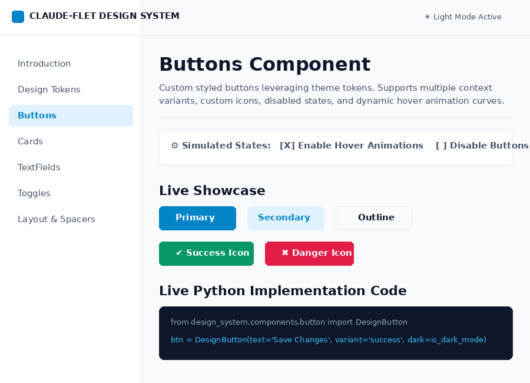
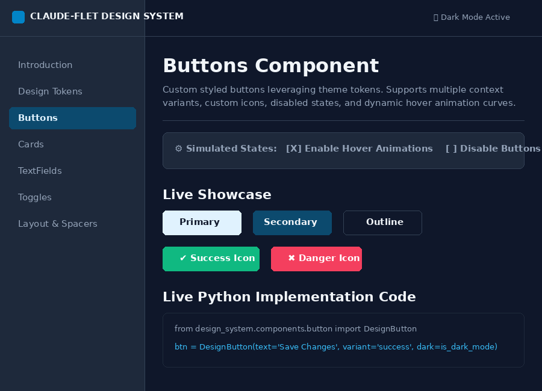

# 🎨 Flet Token-Driven Design System

A professional, production-ready, and highly scalable **Design System** built entirely using **Flet** and **Python**, with dependencies managed via **Poetry**.

---

## ✨ Features

*   **Three-Layer Token Architecture**: Primitives (colors, spacings, radiuses, font hierarchies) $\rightarrow$ Semantic bindings (light/dark mode variants) $\rightarrow$ Component-specific styles.
*   **100% Theme Swapping**: Seamless, real-time dynamic transition between **Light Mode** and **Dark Mode** matching semantic tokens.
*   **Custom Component Library**: Highly configurable, production-ready wrappers for Typography, Buttons, Cards, Inputs, and Selection Toggles.
*   **Interactive Sandbox Docs**: A dual-pane documentation and live preview browser running locally on **port 8550**.
*   **WSL & Headless Ready**: Pre-configured to render in web-mode to bypass missing Linux media and GTK/GStreamer dependencies.
*   **Fully Tested**: Built-in test suite powered by `pytest` ensuring stable token resolution.

---

## 📸 Interface Showcase

### Layout Wireframe
Below is an overview of the interactive sandbox and documentation app layout:

```text
┌──────────────────────────────────────────────────────────────────────────────────┐
│  [🎨] CLAUDE-FLET DESIGN SYSTEM                     v0.1.0     [🌙 Switch Theme] │
├─────────────────────────┬────────────────────────────────────────────────────────┤
│ DOCUMENTATION           │  🎨 Button Component                                   │
│                         │  Custom styled buttons leveraging theme tokens.        │
│  • Introduction         │                                                        │
│  • Design Tokens        │  ┌──────────────────────────────────────────────────┐  │
│  • Buttons [Active]     │  │  ⚙️ Button Controls:  [ ] Disable Buttons          │  │
│  • Cards                │  └──────────────────────────────────────────────────┘  │
│  • TextFields           │                                                        │
│  • Toggles              │  ┌──────────────────────────────────────────────────┐  │
│  • Layout & Spacers     │  │  Live Showcase:                                  │  │
│                         │  │  [Primary]  [Secondary]  [Outline]  [Success ✔]  │  │
│                         │  └──────────────────────────────────────────────────┘  │
│                         │                                                        │
│                         │  ┌──────────────────────────────────────────────────┐  │
│                         │  │  How to Use:                                     │  │
│                         │  │  btn = DesignButton("Click Me", variant="primary")│ │
│                         │  └──────────────────────────────────────────────────┘  │
└─────────────────────────┴────────────────────────────────────────────────────────┘
```

### Light & Dark Mode App Screenshots
To visualize the design system in action, run the local server and capture your own screenshots to place in the `assets/` directory:

| ☀️ Light Mode Showcase | 🌙 Dark Mode Showcase |
| :---: | :---: |
|  |  |

> 💡 **Tip for Users**: Run the application locally, capture screenshots of your browser tab at `http://localhost:8550`, and save them as `assets/showcase-light.png` and `assets/showcase-dark.png` to complete your GitHub repository landing page!

---

## 🚀 Getting Started

### 📦 Installation

Ensure you have **Poetry** installed, then run:

```bash
# Clone the repository
git clone https://github.com/JustanProvence/design.git
cd design

# Install dependencies in virtualenv
poetry install
```

### 🏃 Running the Applications

Flet is pre-configured to run as a local web server, resolving any WSL or headless media environment issues.

### 🎨 Start the Interactive Sandbox Docs
You can launch the central design system sandbox and documentation server on port `8550` using the Poetry script command:
```bash
poetry run design-system
```
Or directly using python:
```bash
poetry run python src/design_system/main.py
```

### 📱 Start the Responsive Application Example
You can launch the responsive application example on port `8551` using the Poetry script command:
```bash
poetry run design-system-example
```
Or directly using python:
```bash
poetry run python responsive_app_example/main_flet.py
```

### 🤖 Start the Discord Status Bot
To launch the integrated Discord assistant bot (ensure your `DISCORD_BOT_TOKEN` and `GEMINI_API_KEY` are set in `.env`):
```bash
poetry run design-system-bot
```

Now, navigate your web browser to:
👉 **`http://localhost:8550`**

---

## 📐 Token-Driven Development

Our central source of truth for tokens is located in `src/design_system/tokens/tokens.json`. 

### Schema Preview (`tokens.json`):
```json
{
  "global": {
    "colors": {
      "blue-600": "#0284C7",
      "slate-900": "#0F172A"
    },
    "spacing": {
      "sm": 8,
      "md": 12
    }
  },
  "light": {
    "colors": {
      "primary": "blue-600",
      "background": "slate-50"
    }
  },
  "dark": {
    "colors": {
      "primary": "blue-100",
      "background": "slate-900"
    }
  }
}
```

### Loading Tokens programmatically:
```python
from design_system.tokens.manager import tokens

# Resolve primary color hex code (Light vs Dark mode)
primary_light_hex = tokens.get_color("primary", dark=False) # -> #0284C7
primary_dark_hex = tokens.get_color("primary", dark=True)   # -> #E0F2FE

# Fetch spacing or radius
padding_md = tokens.get_spacing("md") # -> 12
border_radius = tokens.get_radius("md") # -> 12
```

---

## 🧱 Custom Components API

All components accept a `dark` boolean parameter (e.g. `dark=True`/`dark=False`) to instantly adapt their styles to light/dark themes.

### 1. Typography (`components/typography.py`)
```python
from design_system.components.typography import DisplayText, HeadingText, BodyText

DisplayText("Premium Brand Banner", dark=is_dark)
HeadingText("Section Header", level=2, dark=is_dark)
BodyText("Standard body copy details here.", size="md", dark=is_dark)
```

### 2. Buttons (`components/button.py`)
Supports `primary`, `secondary`, `outline`, `text`, `success`, `warning`, and `danger` variants.
```python
from design_system.components.button import DesignButton
import flet as ft

btn = DesignButton(
    text="Save Changes",
    variant="success",
    icon=ft.icons.SAVE,
    on_click=save_handler,
    dark=is_dark
)
```

### 3. Cards (`components/card.py`)
Supports interactive hover lift-on-shadow and background shifting.
```python
from design_system.components.card import DesignCard

card = DesignCard(
    content=ft.Text("Hello World"),
    variant="surface", # surface, variant, outline
    interactive=True,
    on_click=click_handler,
    dark=is_dark
)
```

### 4. TextFields (`components/input.py`)
```python
from design_system.components.input import DesignTextField

text_field = DesignTextField(
    label="Secure Password",
    is_password=True,
    can_reveal_password=True,
    prefix_icon=ft.icons.LOCK,
    dark=is_dark
)
```

---

## 🧪 Testing

We use `pytest` to verify the state of our Token Manager and UI component initializers.

```bash
# Run pytest in the poetry env
poetry run pytest
```
